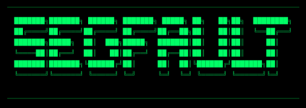

# segfault hackzine

segfault is a minimalistic Phrack-like copy, community driven hacker zine for the curious and the bored, the ones who refuse to accept the surface of things.
The ones who ask why, how, and what happens if I flip this bit. The ones who seek after knowledge.

This is a space for people who learn by breaking, reversing, and thinking outside the box.

Posts are submitted as pull requests, reviewed in the open, and published by the community.
No bullshit, just people sharing knowledge in the spirit of classic underground zines like Phrack.

We don't care who you are, where you're from, or what credentials you flash. We exist without skin color, without nationality, without religious bias.
If you can explain something interesting, weird, broken, or dangerous, this is your place.

Curiosity is not a crime.

Welcome to segfault.
Read. Break. Experiment. Share. Repeat.

## Why

The main purpose of this hackzine is to make hacking hands on and accessible.
Nobody starts with kernel exploits. Some start with LEDs, radios, locks, or old laptops rescued from the trash.

segfault is meant to be printed, folded, and shared, just like old fanzines.
Give it to a kid in your town. Redistribute it in your hometown. Your hackerspace. Your school. Your pub. Your basement.

Curiosity spreads faster than wifi.

## Disclaimer

All content is provided for educational purposes only.

Do not test techniques on systems you do not own or have permission to use.

Contributors are not responsible for misuse.

If you break the law, that’s on you.

If you learn something, fix something, or build something better, that's the point.

## Contributing

Currently there are a few posts that I’ll write myself to get things started, things that have been on my mind for years. Nothing fancy.

I encourage you to do the same. If you find something cool, write about it and open a PR.

A hack isn't just computer related. A hack can be anything from bushcrafting to locks, composting to solar panels, bureaucracy to dumpster diving.

Pull requests are more than welcome.

## The About Page

It's currently about me, if this hits off, I'll remove all my personal data and host this github page on a seperate github account.
